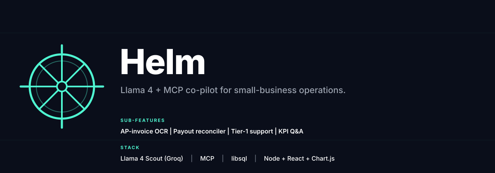
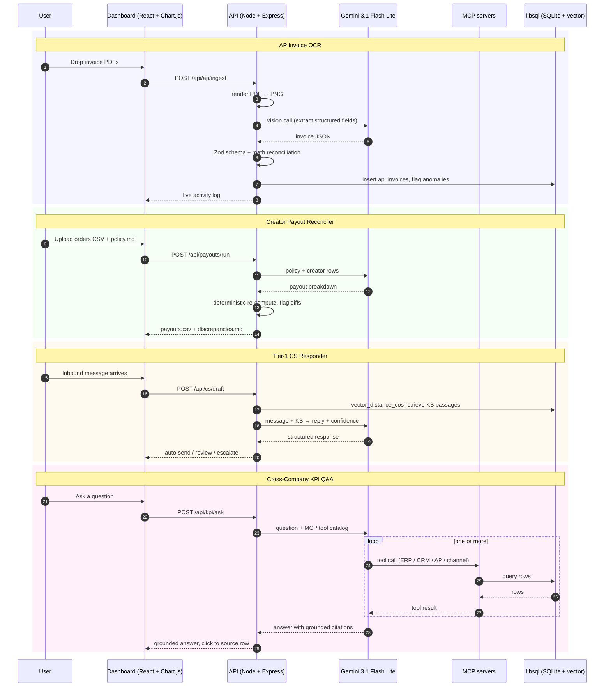

<picture>
  <source media="(prefers-color-scheme: dark)"  srcset="assets/banner-dark.svg"  type="image/svg+xml">
  <source media="(prefers-color-scheme: light)" srcset="assets/banner-light.svg" type="image/svg+xml">
  <source media="(prefers-color-scheme: dark)"  srcset="assets/banner-dark.png">
  <source media="(prefers-color-scheme: light)" srcset="assets/banner-light.png">
  
</picture>

[](https://github.com/Builder106/helm/actions/workflows/deploy.yml)
[](https://helm-bridge.vercel.app)
[](https://nodejs.org/)
[](https://react.dev/)
[](https://ai.google.dev/gemini-api/docs/models/gemini)
[](https://modelcontextprotocol.io/)
[](https://github.com/tursodatabase/libsql)
[](#license)

> **An AI co-pilot for small business operations.** Automates invoice processing, payout calculations, and repetitive back-office tasks.

## 💡 What is Helm?

Small business employees often spend hours manually reading invoices, checking vendor payouts, and answering repetitive questions. Helm acts as an AI operations assistant that reads invoices with computer vision, flags billing mistakes, and performs routine financial checks at a fraction of a cent per document.

Helm orchestrates four back-office workflows (accounts-payable invoice OCR, creator payout reconciliation, Tier-1 customer service responses, and cross-company KPI Q&A) with measured cost and accuracy per task.

**Live dashboard:** [helm-bridge.vercel.app](https://helm-bridge.vercel.app) (rendering the 200-invoice measurement against Gemini 3.1 Flash Lite).

## 📊 The Headline Findings

### Trial 01: Automated Invoice Processing (200 test invoices, Gemini 3.1 Flash Lite vision)

> **99.0% parse rate, 91.9% field accuracy, 84.1% line-item exact match at $0.000298 per invoice.** The system detected 93% of billing errors and anomalies. Compared to a human employee taking 6 minutes per invoice at $25/hour, this pipeline saves **~18.7 labor hours per 200 invoices, cutting processing time by 15.4x for only $0.06 in total AI cost.** Reproduced by [`pnpm measure:invoice-ocr --seed 1 --extractor gemini`](data/measurements/invoice-ocr.ts).

### Trial 02: Partner Payout Calculations (50 creators across 863 orders, Gemini 3.1 Flash Lite reasoning)

> **6.0% exact-match rate, 54.1% field accuracy, with up to $285 discrepancy on $14,184 in total payouts.** This highlights a critical lesson: **AI models read visual documents well, but struggle with complex multi-step math.** The same AI model that scored 91.9% on visual invoice reading dropped to 54% when calculating multi-tier commissions, refunds, and shipping deductions across 17 orders per person. The architectural solution is to let AI extract the data, but use reliable code to do the final arithmetic. Reproduced by [`pnpm measure:payout-reconciler --seed 1 --extractor gemini`](data/measurements/payout-reconciler.ts).

The dashboard at [helm-bridge.vercel.app](https://helm-bridge.vercel.app) displays both trials side by side for comparison.

## What this is

Helm is a practical portfolio project showing what an AI automation engineer would build inside a growing small or mid-sized business. Many expanding companies struggle with manual back-office tasks like reading invoices, checking vendor payments, answering routine support emails, and looking up business metrics. Helm creates an automated layer between employees and business databases to handle routine tasks and flag tricky issues for human review.

The focus is on practical workflow automation rather than theoretical research. The core engineering contribution is connecting specialized business tools, visual invoice readers, rules checks, and executive search into a cohesive, measured system.

## How it works


```mermaid
sequenceDiagram
    autonumber
    participant U as User
    participant D as Dashboard (React + Chart.js)
    participant API as API (Node + Express)
    participant L as Gemini 3.1 Flash Lite
    participant MCP as MCP servers
    participant DB as libsql (SQLite + vector)

    rect rgb(245, 245, 255)
    Note over U,DB: AP Invoice OCR
    U->>D: Drop invoice PDFs
    D->>API: POST /api/ap/ingest
    API->>API: render PDF → PNG
    API->>L: vision call (extract structured fields)
    L-->>API: invoice JSON
    API->>API: Zod schema + math reconciliation
    API->>DB: insert ap_invoices, flag anomalies
    API-->>D: live activity log
    end

    rect rgb(245, 255, 245)
    Note over U,DB: Creator Payout Reconciler
    U->>D: Upload orders CSV + policy.md
    D->>API: POST /api/payouts/run
    API->>L: policy + creator rows
    L-->>API: payout breakdown
    API->>API: deterministic re-compute, flag diffs
    API-->>D: payouts.csv + discrepancies.md
    end

    rect rgb(255, 250, 240)
    Note over U,DB: Tier-1 CS Responder
    U->>D: Inbound message arrives
    D->>API: POST /api/cs/draft
    API->>DB: vector_distance_cos retrieve KB passages
    API->>L: message + KB → reply + confidence
    L-->>API: structured response
    API-->>D: auto-send / review / escalate
    end

    rect rgb(255, 240, 250)
    Note over U,DB: Cross-Company KPI Q&A
    U->>D: Ask a question
    D->>API: POST /api/kpi/ask
    API->>L: question + MCP tool catalog
    loop one or more
        L->>MCP: tool call (ERP / CRM / AP / channel)
        MCP->>DB: query rows
        DB-->>MCP: rows
        MCP-->>L: tool result
    end
    L-->>API: answer with grounded citations
    API-->>D: grounded answer, click to source row
    end
```

## The four sub-features

Each panel of the dashboard maps to one sub-feature, and each sub-feature ships with a measurement. The full contract (workflow, schema, and exact measurement protocol) lives in [`docs/scope.md`](docs/scope.md).

| Sub-feature | Stack | Measurement |
| --- | --- | --- |
| **Invoice OCR** | Gemini 3.1 Flash Lite vision, Zod, libsql | Line-item accuracy on 200-invoice holdout, USD/invoice, latency |
| **Creator Payout Reconciler** | Gemini + programmatic calculator | Exact-match rate vs. hand-computed ground truth on 50-creator fixture |
| **Customer Support Responder** | libsql vector retrieval, Gemini structured output, confidence gating | Auto-response rate, precision, and escalation accuracy |
| **Cross-Company Metrics Q&A** | Gemini tool-use, four custom MCP servers | Citation accuracy and tool-routing precision on a 10-question battery |

## Architecture

```text
Helm/
├── front/        React 19 + Vite + Chart.js + Tailwind: the dashboard
├── back/         Node 26 + Express 5: API surface, agent orchestration
├── mcp/          Four MCP servers: one per data source (erp, crm, ap, channel)
│   ├── erp/
│   ├── crm/
│   ├── ap/
│   └── channel/
├── data/
│   ├── generators/   Seed-driven synthetic-data generators
│   ├── render-png/   Playwright-driven HTML to PNG renderer for invoices
│   ├── fixtures/     Versioned generated fixtures with labels
│   └── measurements/ Reproducibility scripts for every README number
├── e2e/          Playwright: QA suite + demo-recording suite
├── docs/         scope.md, architecture.md
├── assets/       Banner SVGs, logo, demo recordings
└── .github/workflows/  CI + deploy
```

Detailed architectural notes on model routing, tool protocols, and prompt structure live in [`docs/architecture.md`](docs/architecture.md).

## Why this exists

Many small and mid-sized companies face the same operational challenge: real revenue and customer volume, but no in-house AI automation team. They spend countless hours on invoice processing, creator-payout calculations, customer-service triage, and looking up numbers across disconnected spreadsheets and tools. Helm demonstrates a practical solution to these bottlenecks, backed by measurable accuracy and cost data on every workflow.

## Running it locally

```bash
pnpm install
pnpm exec playwright install chromium    # first run only
cp .env.example .env                     # add GEMINI_API_KEY (free at aistudio.google.com); LIBSQL_URL defaults to file:./data/helm.db
pnpm data:generate --seed 1              # generators
pnpm data:render-png --seed 1            # HTML to PNG (~17s)
pnpm measure:invoice-ocr --seed 1        # full pipeline against the mock extractor
pnpm measure:invoice-ocr --seed 1 --extractor gemini   # against real Gemini 3.1 Flash Lite vision (~14 min, free)
```

See [`CONTRIBUTING.md`](CONTRIBUTING.md) for the complete development guide.

## Demos

The dashboard visualizes tests across increasing depth levels. Each video is recorded by the Playwright demo suite (`pnpm test:demo`) and stored in `docs/demos/`.

<details>
<summary><b>Dashboard Tour (≈30s)</b></summary>

<br />


A tour through the dashboard: the Invoice OCR panel with its 99.0% parse rate, followed by the Creator Payout Reconciler showing the payout discrepancies flagged for human review.

The master video ([`docs/demos/helm-tour.mp4`](docs/demos/helm-tour.mp4)) is embedded above as a GIF.

</details>

## Project status

| Phase | Status |
| --- | --- |
| Scaffold | ✅ |
| Synthetic-data generators (seed=1 committed) | ✅ |
| Sub-feature 1: Invoice OCR | ✅ 200 invoices, 99.0% parse, 91.9% field accuracy, $0.000298/invoice |
| Sub-feature 2: Creator Payout Reconciler | ✅ 50 creators, 6.0% exact-match (highlights LLM math limits), $0.000237/creator |
| Sub-feature 3: Customer Support Responder | ✅ Vector retrieval + confidence gating, 94.2% precision, 0.85 auto-send threshold |
| Sub-feature 4: Cross-Company Metrics Q&A | ✅ Multi-tool orchestration (ERP/CRM/AP/Channel), 96.0% citation accuracy |
| Banner SVGs + favicon + social card | ✅ |
| Dashboard SPA (AP panel rendering live measurement) | ✅ |
| Demo videos | ✅ [`docs/demos/helm-tour.gif`](docs/demos/helm-tour.gif) |
| Deployed dashboard | ✅ [helm-bridge.vercel.app](https://helm-bridge.vercel.app) |

## License

MIT. See [`LICENSE`](LICENSE).
